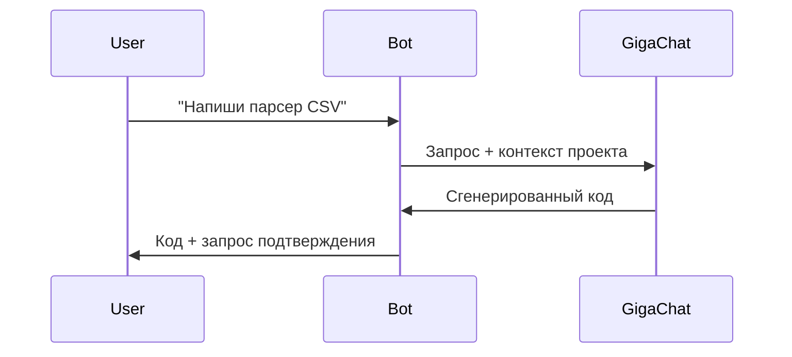

# 🤖 AI Code Assistant Bot

**Telegram-бот для автоматического программирования с поддержкой GigaChat и других ИИ**

[](https://www.python.org/)
[](https://core.telegram.org/bots)
[](https://developers.sber.ru/docs/ru/gigachat/api/overview)

Бот помогает разработчикам:
- Генерировать код по описанию
- Исправлять ошибки в существующем коде
- Запускать и тестировать скрипты
- Управлять проектом через Telegram

## 🚀 Возможности

- **Генерация кода** по текстовому описанию ("напиши Flask API для TODO-листа")
- **Авто-исправление** ошибок с анализом stack trace
- **Безопасное выполнение** Python-кода и shell-команд
- **Поддержка нескольких ИИ** (GigaChat, BotHub)
- **Работа с контекстом** проекта (анализ существующих файлов)

## 📂 Структура проекта

```
ai-code-bot/
├── .env                    # Переменные окружения
├── .gitignore
├── config/
│   ├── __init__.py         # Настройки приложения
│   └── models.py           # Конфигурация LLM
├── core/
│   ├── code_generator/     # Генерация кода
│   │   ├── __init__.py
│   │   ├── python_gen.py   # Генератор Python
│   │   └── validator.py    # Валидация кода
│   ├── llm/                # Интеграция с ИИ
│   │   ├── client.py       # Базовый клиент
│   │   ├── gigachat.py     # GigaChat API
│   │   └── bothub.py       # BotHub API
│   ├── project/            # Работа с проектом
│   │   ├── analyzer.py     # Анализ файлов
│   │   └── executor.py     # Запуск кода
│   └── utils.py            # Вспомогательные функции
├── handlers/               # Telegram-обработчики
│   ├── commands.py         # /start, /help
│   ├── messages.py         # Текстовые сообщения
│   └── callbacks.py        # Inline-кнопки
├── tests/                  # Тесты (pytest)
├── main.py                 # Точка входа
└── requirements.txt        # Зависимости
```

## 🔧 Установка

1. **Клонируйте репозиторий**:
   ```bash
   git clone https://github.com/ваш-username/ai-code-bot.git
   cd ai-code-bot
   ```

2. **Создайте виртуальное окружение**:
   ```bash
   python -m venv venv
   source venv/bin/activate  # Linux/Mac
   venv\Scripts\activate     # Windows
   ```

3. **Установите зависимости**:
   ```bash
   pip install -r requirements.txt
   ```

4. **Настройте окружение**:
   Создайте файл `.env`:
   ```ini
   TELEGRAM_TOKEN=ваш_токен_бота
   GIGACHAT_CREDENTIALS=ваш_ключ_gigachat
   # Опционально:
   BOT_HUB_API_KEY=ваш_ключ_bothub
   ```

## 🖥 Использование

**Запуск бота**:
```bash
python main.py
```

**Примеры команд**:
1. Сгенерировать код:
   ```
   /создай api.py Flask REST API для управления задачами
   ```

2. Исправить ошибки:
   ```
   /исправить api.py
   ```

3. Запустить скрипт:
   ```
   /запустить api.py
   ```

4. Выполнить команду:
   ```
   cmd: pip install pandas
   ```

## 🌟 Особенности реализации

### Модуль `code_generator`
```python
# Пример генерации кода
generator = PythonGenerator(llm_client)
status, code = generator.generate(
    CodeTask(description="Flask API с JWT-аутентификацией")
)
```

### Интеграция с ИИ


### Безопасность
- Валидация синтаксиса перед сохранением
- White-list для shell-команд
- Изолированное выполнение кода

## 📈 Планы развития
- [ ] Добавить поддержку JavaScript/TypeScript
- [ ] Интеграция с GitHub/GitLab
- [ ] Автоматическое тестирование кода

## 🤝 Как помочь проекту
1. Сообщайте об ошибках в Issues
2. Предлагайте улучшения через Pull Requests
3. Делитесь идеями в Discussions

---

**Лицензия**: MIT  
**Автор**: [Ваше имя]  
**Версия**: 1.0.0