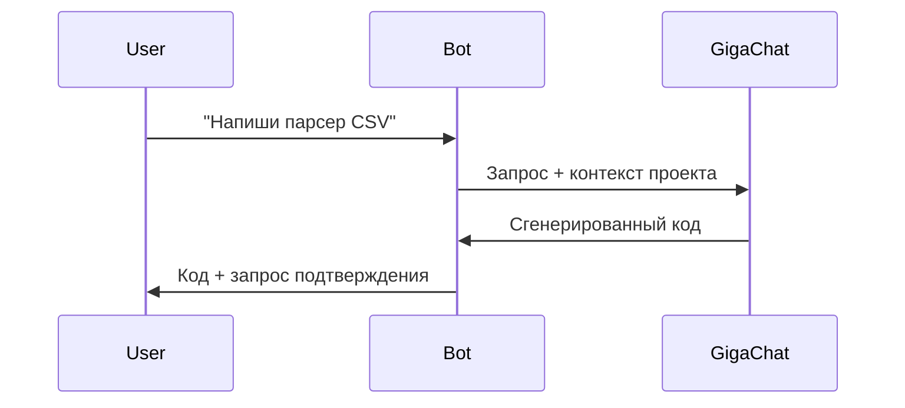

# 🤖 AI Code Assistant Bot

**Telegram-бот для анализа и управления проектами с поддержкой GigaChat**

[](https://www.python.org/)
[](https://core.telegram.org/bots)
[](https://developers.sber.ru/docs/ru/gigachat/api/overview)

Бот помогает разработчикам:
- Анализировать структуру проектов
- Просматривать и редактировать файлы
- Управлять проектами через Telegram или CLI
- Анализировать код и получать рекомендации
- Оценивать зрелость проекта

## 🚀 Возможности

- **Анализ проектов** - полная статистика и структура
- **Управление проектами** - создание, переключение, просмотр
- **Анализ кода** - оценка зрелости и рекомендации
- **CLI и Telegram интерфейсы** - удобная работа в любом формате
- **Поддержка Python проектов** - анализ зависимостей и структуры

## 📂 Структура проекта

```
ai-code-bot/
├── .env.example           # Пример файла с переменными окружения
├── .gitignore
├── config/
│   ├── settings.py        # Основные настройки приложения
│   └── config.json         # Конфигурация бота
├── core/
│   ├── bot/              # Основная логика бота
│   │   ├── application.py  # Основной класс приложения
│   │   ├── cli.py          # CLI интерфейс
│   │   └── config.py       # Конфигурация бота
│   ├── llm/                # Интеграция с ИИ
│   │   ├── client.py       # Базовый клиент LLM
│   │   └── gigachat.py     # GigaChat API клиент
│   ├── project/            # Работа с проектом
│   │   ├── analyzer.py     # Анализ структуры проекта
│   │   ├── executor.py     # Выполнение команд
│   │   └── manager.py      # Управление проектами
│   └── __init__.py         # Инициализация пакета
├── handlers/               # Обработчики команд и сообщений
│   ├── commands.py         # Основные команды (/start, /help)
│   ├── nlp_processor.py    # Обработка естественного языка
│   ├── project_handlers.py # Обработчики управления проектами
│   └── register.py         # Регистрация обработчиков
├── projects/               # Директория для хранения проектов
├── main.py                 # Точка входа
└── requirements.txt        # Зависимости
```

## 🔧 Установка

1. **Клонируйте репозиторий**:
   ```bash
   git clone https://github.com/LeonidYasin/AI-Code-Assistant-Bot.git
   cd AI-Code-Assistant-Bot
   ```

2. **Создайте виртуальное окружение**:
   ```bash
   python -m venv venv
   # Активация для Windows:
   venv\Scripts\activate
   # Или для Linux/Mac:
   source venv/bin/activate
   ```

3. **Установите зависимости**:
   ```bash
   pip install -r requirements.txt
   ```

4. **Настройте окружение**:
   Скопируйте пример конфигурации и настройте под свои нужды:
   ```bash
   copy .env.example .env
   # Отредактируйте .env файл, указав свои ключи доступа
   ```

   Пример содержимого `.env`:
   ```ini
   # Токен Telegram бота (получить у @BotFather)
   TELEGRAM_TOKEN=your_telegram_token
   
   # Учетные данные GigaChat (опционально)
   GIGACHAT_CREDENTIALS=your_gigachat_credentials
   
   # Путь к директории проектов (по умолчанию: ./projects)
   PROJECTS_DIR=./projects
   ```

## 🖥 Использование

### Запуск в режиме Telegram бота:
```bash
python main.py
```

### Использование через командную строку (CLI):
```bash
# Анализ проекта
python main.py analyze_project

# Показать справку
python main.py --help
```

### Основные команды в Telegram:

#### Управление проектами:
```
/project list           - Показать список проектов
/project create <имя>   - Создать новый проект
/project switch <имя>   - Переключиться на проект
/project info           - Информация о текущем проекте
```

#### Анализ кода:
```
/analyze <код>          - Проанализировать фрагмент кода
/analyze_project        - Проанализировать текущий проект
```

#### Общие команды:
```
/start - Начать работу с ботом
/help  - Показать справку
```

### Примеры использования:

1. **Создание и переключение на проект**:
   ```
   /project create my_new_project
   /project switch my_new_project
   ```

2. **Анализ кода**:
   ```
   /analyze def hello():
       return "Привет, мир!"
   ```

3. **Анализ проекта**:
   ```
   /analyze_project
   ```

## 🌟 Особенности реализации

### Модуль `code_generator`
```python
# Пример генерации кода
generator = PythonGenerator(llm_client)
status, code = generator.generate(
    CodeTask(description="Flask API с JWT-аутентификацией")
)
```

### Интеграция с ИИ


### Безопасность
- Валидация синтаксиса перед сохранением
- White-list для shell-команд
- Изолированное выполнение кода

## 📈 Планы развития
- [ ] Добавить поддержку JavaScript/TypeScript
- [ ] Интеграция с GitHub/GitLab
- [ ] Автоматическое тестирование кода

## 🤝 Как помочь проекту
1. Сообщайте об ошибках в Issues
2. Предлагайте улучшения через Pull Requests
3. Делитесь идеями в Discussions

---

**Лицензия**: MIT  
**Автор**: [Ваше имя]  
**Версия**: 1.0.0